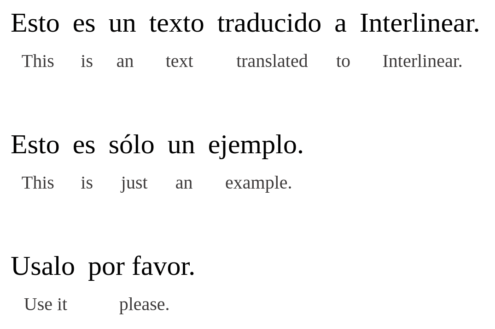

# interlinearize

Generates an *[interlinear text](https://en.wikipedia.org/wiki/Interlinear_gloss)* — a text with translation between lines — given translation pairs of semantic units (the shortest possible part of a phrase which makes sense when translated).

Translations are separated by a tab, pairs by a newline `\n`, and paragraphs by pipes `|`.

For example:
```
Esto	This
es	is
un	an
texto	text
traducido	translated
a	to
Interlinear.	Interlinear.
|	|
Esto	This
es	is
sólo	just
un	an
ejemplo.	example.
|	
Usalo	Use it
por favor.	please.
```



Inspired from [Interlinear Books](https://interlinearbooks.com/) and their [interlinearizer tool](https://interlinearbooks.com/tools/interlinearizer/).

